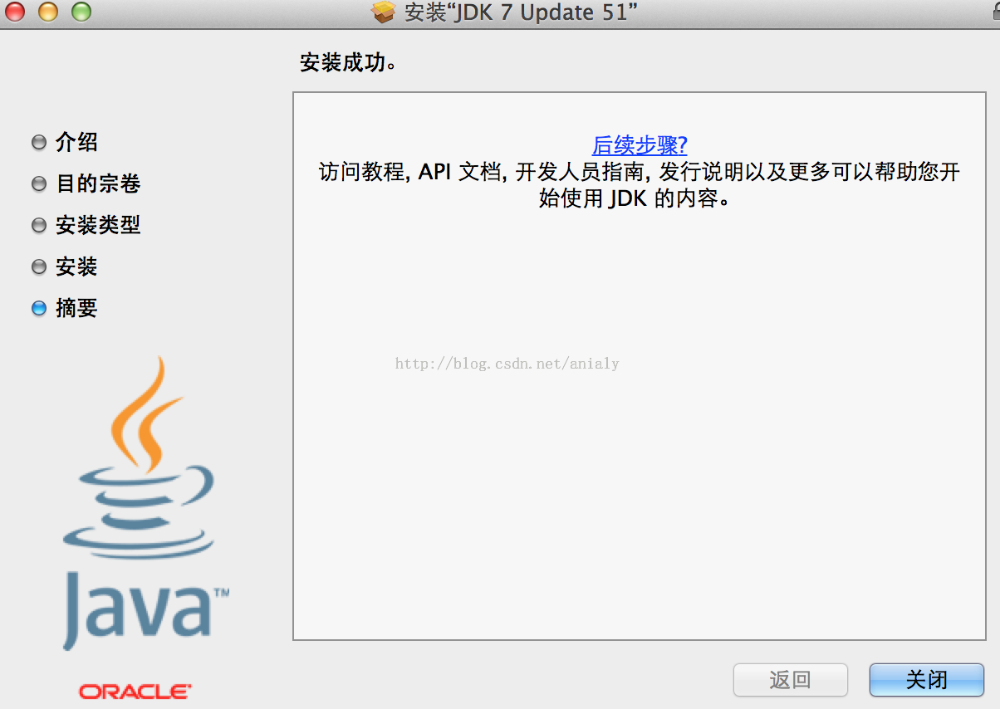
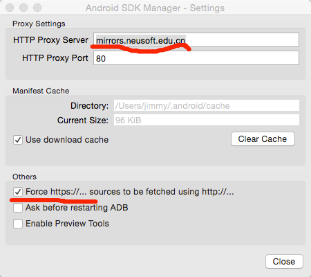
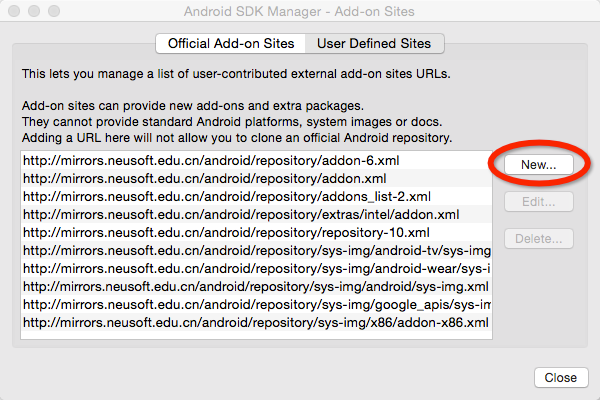
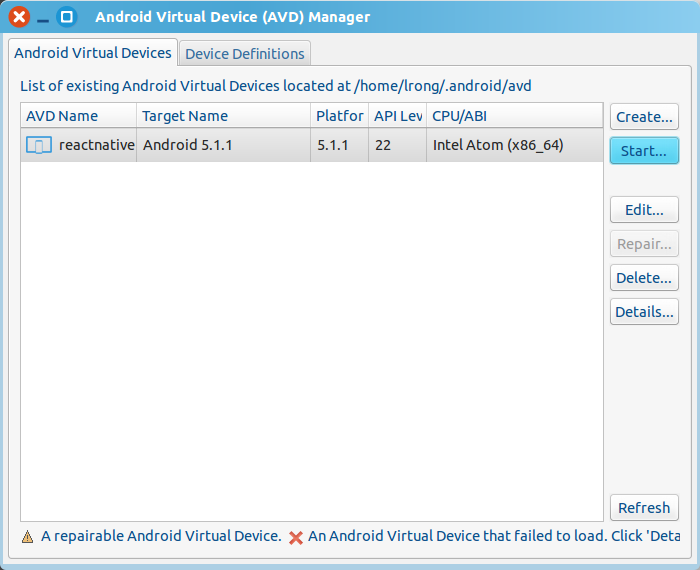
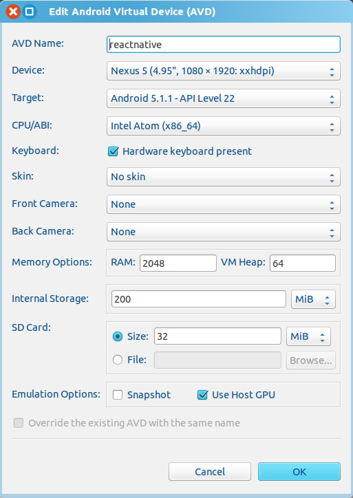

## 开发环境

#### ReactNative开发环境

1. 安装brew

        /usr/bin/ruby -e "$(curl -fsSL https://raw.githubusercontent.com/Homebrew/install/master/install)"

    修改brew源地址

        brew install git
        # 重新安装brew以达到更换镜像源地址的目的
        cd ~/tmp
        git clone git://mirrors.tuna.tsinghua.edu.cn/homebrew.git
        rm -rf /usr/local/.git
        rm -rf /usr/local/Library
        cp -R homebrew/.git /usr/local/
        cp -R homebrew/Library /usr/local/

2. 安装npm和node

        # 这里安装npm就会顺带安装node
        brew install npm

    更换npm镜像源

        # 编辑 ~/.npmrc 加入下面内容
        registry = https://registry.npm.taobao.org

3. 安装react-native-cli

        npm install react-native-cli
        
4. 安装JDK

    下载[jdk](http://www.oracle.com/technetwork/java/javase/downloads/jdk7-downloads-1880260.html)。点击安装即可！

    

5. 安装android sdk

        # so easy
        brew install android-sdk
        # vim ~/.bashrc 写入如下内容：
        export ANDROID_HOME=/usr/local/opt/android-sdk

    android sdk配置东软镜像源并安装应该安装的包

        android sdk

    打开过后，系统界面最上边，Android SDK Manager -> Preferences...

    

    http proxy server这里填写： mirrors.neusoft.edu.cn

    端口填写80，然后把Force https:// 前的勾勾上
    
    mac顶部菜单Tools->Manage Add-on Site

    

    把下面这堆网址：

        http://mirrors.neusoft.edu.cn/android/repository/addon-6.xml 
        http://mirrors.neusoft.edu.cn/android/repository/addon.xml 
        http://mirrors.neusoft.edu.cn/android/repository/extras/intel/addon.xml 
        http://mirrors.neusoft.edu.cn/android/repository/sys-img/android-tv/sys-img.xml 
        http://mirrors.neusoft.edu.cn/android/repository/sys-img/android-wear/sys-img.xml 
        http://mirrors.neusoft.edu.cn/android/repository/sys-img/android/sys-img.xml 
        http://mirrors.neusoft.edu.cn/android/repository/sys-img/google_apis/sys-img.xml 
        http://mirrors.neusoft.edu.cn/android/repository/sys-img/x86/addon-x86.xml 
        http://mirrors.neusoft.edu.cn/android/repository/addons_list-2.xml 
        http://mirrors.neusoft.edu.cn/android/repository/repository-10.xml

    全手动New加进去，然后就可以下载了

    注：上图中加圈的项，建议勾上，否则有可能创建不了Android模拟设备

6. 配置android avd

    **安装HAXM**

    安装步骤参考如下

    [Intel® Hardware Accelerated Execution Manager](https://software.intel.com/en-us/android/articles/intel-hardware-accelerated-execution-manager)

    接着运行如下命令，启动Android AVD面板。

        android avd

    

    Android AVD面板上单击`create`，开始创建安卓虚拟设备。

    

    在Android AVD面板上选中刚才创建的安卓虚拟设备，并点击`start`就可以启动一个安卓虚拟设备。

#### Beego开发环境

1. 安装golang

        brew install golang

    安装golang后，设置环境变量，首先编辑.bash_profile

        if [ -f ~/.bashrc ]; then
           source ~/.bashrc
        fi
    
    接着编辑.bashrc
    
        export ANDROID_HOME=/usr/local/opt/android-sdk
        export GOPATH=$HOME/gopath
        export PATH=$PATH:$GOPATH/bin

2. 安装beego

        go get github.com/beego/bee
        go get github.com/astaxie/beego
        
3. 安装redis和mongodb

        brew install redis
        brew install mongodb
        
    设置mongodb的用户名和密码
    
        mongo
        use admin
        db.createUser({user: "mongo",pwd: "123456",roles: [ { role: "userAdminAnyDatabase", db: "admin" } ]})
        db.auth("mongo","123456")
        exit
        mongo admin -u mongo -p 123456

